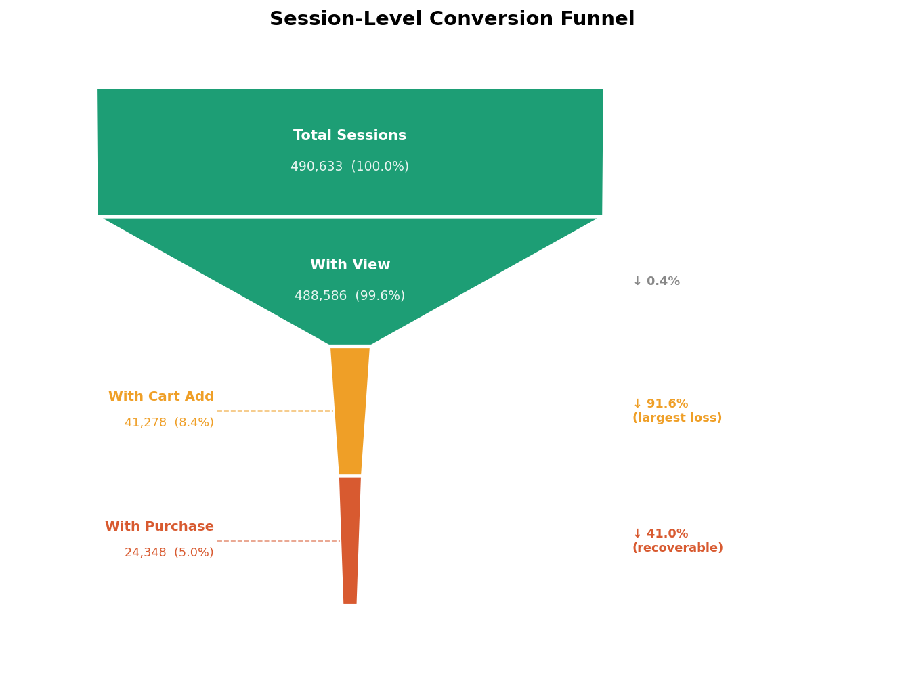
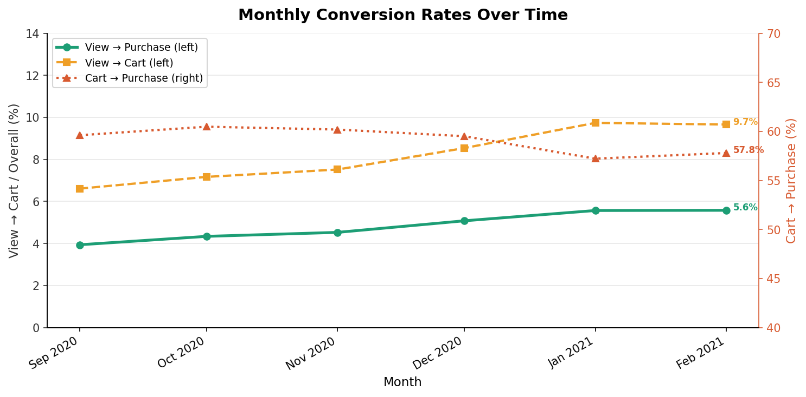
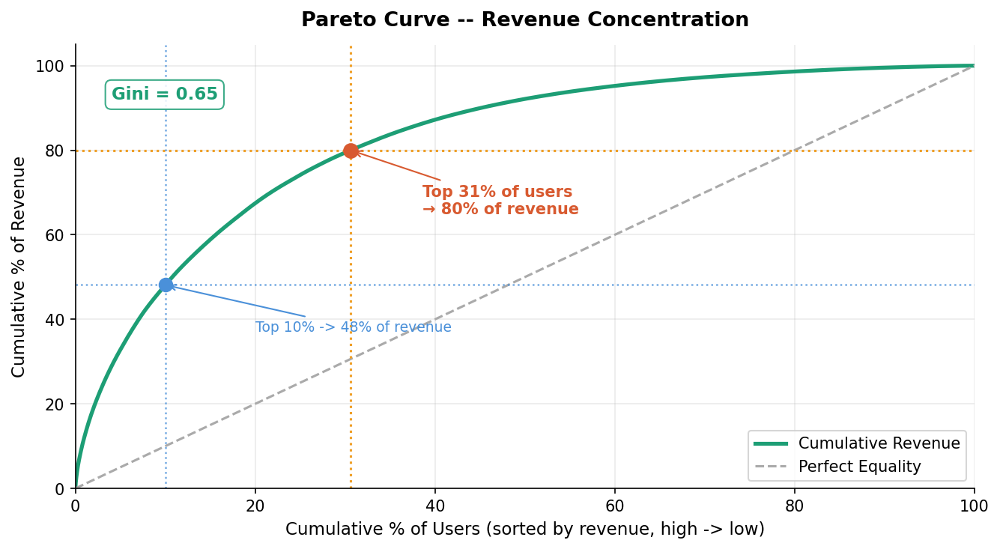
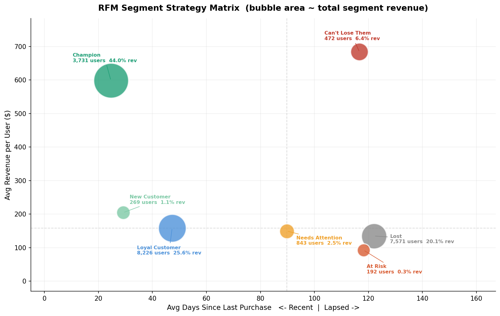
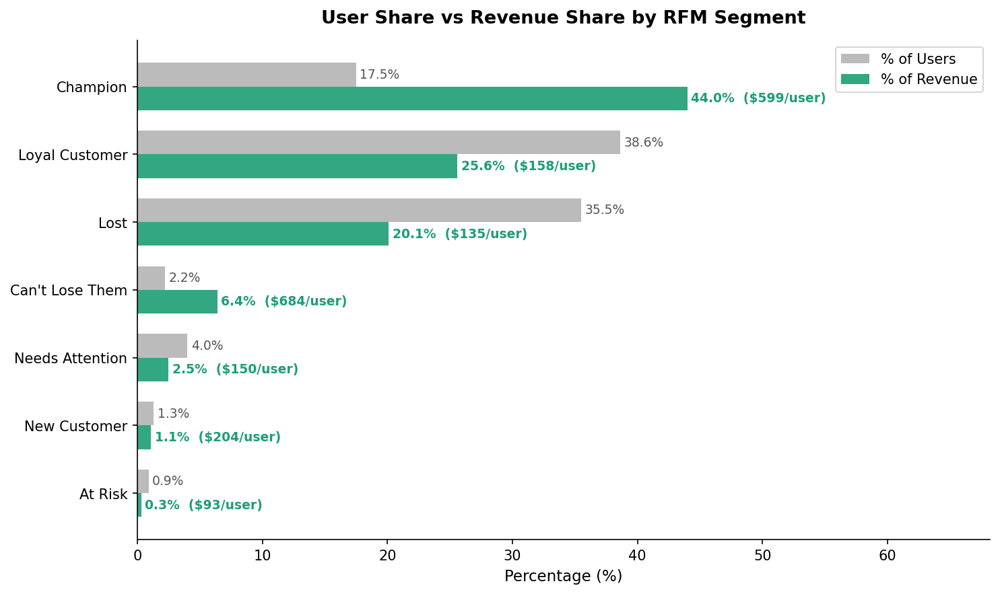
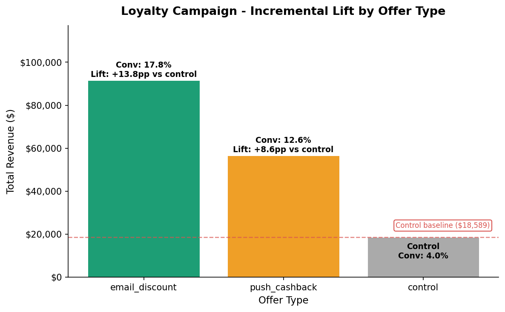

## MEMORANDUM

**To:** Head of E-Commerce Product / VP of Marketing  
**From:** Analytics Team  
**Date:** 2 June 2026  
**Re:** Revenue Leakage Analysis — Funnel Drop-Off, Segment Risk & Recovery Opportunity

---

## Summary

Analysis of the electronics store event log (24 Sep 2020 – 28 Feb 2021, 490,773 sessions, 21,304 purchasing users, $5.13M revenue) identified three structural revenue leakage points: a severe view-to-cart drop-off where 91.5% of browsing sessions never add to cart, a highly concentrated customer base where the top 20% of buyers drive 67.8% of revenue, and a 1,601-user At Risk cohort with $302K in historical spend nearing the point of no return. A simulated loyalty campaign shows email outreach to At Risk users delivers 3.8× higher conversion than push notifications and a 73× ROI against a $0.50/user campaign cost.

---

## Key Findings

### Finding 1 — View-to-cart is the critical drop-off in the funnel

| Funnel step | Sessions | Rate |
|---|---|---|
| Total sessions | 490,773 | — |
| With view | 488,721 | 99.6% of total |
| With cart add | 41,284 | 8.45% of view sessions |
| With purchase | 24,348 | 58.98% of cart sessions |

*Fig 1. The funnel narrows drastically at the view-to-cart step — the gap is structural, not a checkout problem.*

*Fig 2. View→cart rate improved from 6.6% to 9.7% over the period, but remains far below the cart→purchase rate (58%). The constraint is consistently upstream.*

**91.5% of browsing sessions never add a single item to cart.** The overall view-to-purchase rate is 4.98%. Once a user does add to cart, 59.0% complete the purchase — checkout abandonment is not the primary problem. The leakage is happening before the cart: users browse without converting into intent-level engagement. The priority intervention is product-page conversion (recommendations, pricing clarity, social proof), not checkout-flow optimization.

---

### Finding 2 — top 30% of buyers drive 79.6% of revenue; the top 10% alone account for 48.6%

| Buyer decile | Decile revenue | % of total | Cumulative % |
|---|---|---|---|
| Top 10% | $2,491,230 | 48.6% | 48.6% |
| 11–20% | $982,608 | 19.2% | 67.8% |
| 21–30% | $608,188 | 11.9% | 79.6% |
| Bottom 70% | $1,043,369 | 20.4% | 100.0% |

*Fig 3. Gini = 0.65. The top 10% of buyers generate 48% of revenue; the top 31% generate 80%. The curve bows sharply away from the equality line, confirming extreme concentration.*

The top 30% of buyers account for 79.6% of total revenue — slightly tighter than the classic Pareto 80/20. The top decile alone represents nearly half of all revenue ($2.49M of $5.13M). Losing even a fraction of Champion or Can't Lose Them customers has an outsized revenue impact that no amount of new-customer acquisition can compensate for in the short term.

---

### Finding 3 — The At Risk segment (1,601 users, $302K spend) is the highest-priority reactivation target

| Segment | Users | % of users | Avg recency | Avg revenue | Total revenue | % of revenue |
|---|---|---|---|---|---|---|
| Champion | 1,106 | 5.2% | 20 days | $861 | $952,106 | 18.6% |
| Can't Lose Them | 1,045 | 4.9% | 119 days | $516 | $538,700 | 10.5% |
| Loyal Customer | 6,860 | 32.2% | 47 days | $222 | $1,522,478 | 29.7% |
| New Customer | 4,392 | 20.6% | 38 days | $261 | $1,145,721 | 22.4% |
| **At Risk** | **1,601** | **7.5%** | **109 days** | **$189** | **$302,183** | **5.9%** |
| Lost | 3,706 | 17.4% | 131 days | $137 | $506,590 | 9.9% |
| Needs Attention | 2,594 | 12.2% | 105 days | $61 | $157,618 | 3.1% |

*Fig 4. Each bubble is a segment; size = total revenue. At Risk and Can't Lose Them both sit in the high-recency (lapsed) zone — the reactivation window is closing.*

*Fig 5. Champions are 17.5% of users but 44% of revenue ($599/user). At Risk users are 0.9% of users but generate only 0.3% of revenue at $93/user — the gap between their user share and revenue contribution signals underperformance against their historical potential.*

At Risk buyers last purchased ~109 days ago and have documented spend averaging $189/user. They are still within the reactivation window; once recency crosses ~131 days they cluster with the Lost segment, where reactivation rates decline materially. Can't Lose Them (1,045 users, $516 avg spend, 119-day recency) is a second urgent priority — high-value customers already showing the same recency signal as At Risk.

---

### Finding 4 — Email discount outperforms push cashback 3.8× for the At Risk segment (simulated)

| Offer type | Conversion rate | Avg order value | ROI ratio |
|---|---|---|---|
| Email (10% discount) | 19.0% | $192 | 73× |
| Control (no offer) | 5.8% | $193 | 22× |
| Push (5% cashback) | 5.0% | $135 | 14× |

*Results for At Risk segment. Source: q4_loyalty_roi.csv.*

*Fig 6. Email discount generates ~$91K in total revenue vs the $19K control baseline — a +$72K lift. Push cashback outperforms control but trails email by $35K. The revenue gap is the business case for email-first targeting.*

Email delivers 3.8× higher conversion than push (19.0% vs 5.0%). Notably, push cashback performs no better than the no-offer control for At Risk users, suggesting the channel itself is ineffective for this segment — not just the offer size. For the Lost segment, both channels outperform control (email 18.2%, push 12.5%, control 4.0%), but At Risk email is the standout result. For Can't Lose Them specifically, push cashback (16.4%) outperforms email (11.1%) — this segment responds to a different channel and should not receive the same campaign.

*Conversion rates seeded from Klaviyo Electronics E-Commerce Benchmarks (2023). Validate with a live segment analysis before scaling.*

---

## Recommendations

### Recommendation 1 (PRIORITY: HIGH) — Reactivate the At Risk segment via email before they become Lost

Export the 1,601 At Risk users (recency ~60–120 days). Send a single personalized email with a 10% discount on their last-purchased category. At the simulated 19.0% conversion rate and $192 average order value, a full-list campaign projects ~304 conversions and ~$58,000 incremental revenue against an $800 campaign cost (73× ROI). Do not use push for this segment — the simulation shows it performs at no-offer control level.

For Can't Lose Them (1,045 users), use push cashback instead: that segment shows 16.4% conversion on push vs 11.1% on email.

### Recommendation 2 (PRIORITY: HIGH) — Protect the top revenue decile with a VIP retention program

The top 10% of buyers contribute $2.49M — 48.6% of total revenue. Implement a lightweight VIP program targeted at Champion and Can't Lose Them segments (2,151 users combined, $1.49M in revenue, 29.1% of total): early access, dedicated support, or loyalty perks. Can't Lose Them's 119-day avg recency is already a warning signal; re-engagement should begin immediately before they migrate into At Risk.

### Recommendation 3 (PRIORITY: MEDIUM) — Investigate the view-to-cart drop-off at the product page

Only 8.45% of browsing sessions add an item to cart. Run a UX and merchandising audit at the product-page level: relevance of recommended products, pricing clarity, urgency signals, and social proof. Checkout optimization is a secondary concern — once users add to cart, 59% already complete the purchase.

---

## Priority Summary

| Action | Timeline | Estimated cost |
|---|---|---|
| At Risk email reactivation (1,601 users) | 1 week | ~$800 ($0.50/user) |
| Can't Lose Them push reactivation (1,045 users) | 1 week | ~$523 ($0.50/user) |
| VIP retention for Champion + Can't Lose Them | 3–4 weeks | Engineering + ops time |
| Product-page UX audit (view-to-cart) | 4–6 weeks | Engineering time |

---

## Methodology

Data source: REES46 eCommerce Events History in Electronics Store (Kaggle, `mkechinov`).  
Observation window: 24 Sep 2020 – 28 Feb 2021 (5 months, 884,474 raw events after cleaning).  
Funnel analysis at session level (`user_session` as the unit).  
RFM scoring via NTILE(5) in DuckDB on purchasing users only (21,304 users).  
Loyalty simulation seeded with `random.seed(42)`; conversion rates calibrated to Klaviyo Electronics Benchmarks (2023).  
All code and data: `github.com/DanilaKhryshchanovych/ecommerce-revenue-leakage`.  
Interactive dashboard: open `dashboard/dashboard.html` (static, no server needed) or run `python dashboard/dashboard.py` → http://localhost:8050.
